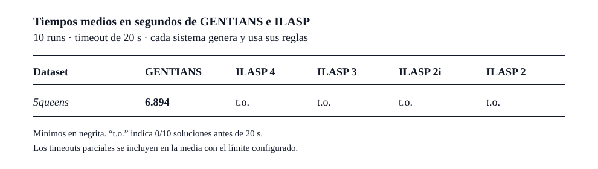

# 5-queens: generación y búsqueda desde el language bias

## Protocolo

El experimento ejecuta únicamente `5queens`. Gentians e ILASP reciben el mismo
background y los mismos 10 ejemplos positivos y 35 negativos. No se entrega a
ninguno una lista de cláusulas aprendibles ni las reglas objetivo comentadas en
la tarea.

Gentians genera su `ClauseSpace` de 4 797 cláusulas desde el language bias y
después ejecuta el GA `steady_state`. ILASP genera su propio espacio desde
declaraciones `#modeb`; los predicados auxiliares `add/3`, `sub/3` y `lt/2`
exponen a ILASP la aritmética que aparece directamente en el bias de Gentians.
Esos predicados forman parte del background y no son hipótesis suministradas.

Se hicieron 10 runs por sistema y versión, de forma secuencial, con un timeout
de 20 segundos. Gentians usa las semillas 1–10. ILASP no ofrece una seed en este
protocolo, pero se ejecutó diez veces para medir variación operacional.

La cifra de Gentians es `total_execution`, que incluye generación de cláusulas,
búsqueda y evaluaciones. La de ILASP es `%% Total`, que incluye generación del
espacio y búsqueda. Como ILASP no alcanzó el bloque final de métricas, sus
timeouts se incorporan como 20 segundos en la media PAR1.

## Resultados



| Dataset | GENTIANS | ILASP 4 | ILASP 3 | ILASP 2i | ILASP 2 |
|---|---:|---:|---:|---:|---:|
| 5queens | **6.894 s** | t.o. | t.o. | t.o. | t.o. |

Gentians resolvió 10/10 runs. Su mediana fue 6.081 s, su desviación estándar
3.961 s y el intervalo observado fue 2.650–16.538 s. La generación de su
`ClauseSpace` consumió una media de 1.756 s, incluida en los 6.894 s.

Cada versión de ILASP agotó los diez timeouts: 0/10 soluciones para ILASP 2,
2i, 3 y 4. Por ello, su media PAR1 es 20 s y su tiempo real de resolución solo
puede expresarse como mayor de 20 s. El proceso permaneció aproximadamente 25 s
en pared porque GNU `timeout` concedió cinco segundos después de `SIGINT`; ese
periodo de cierre no se usa como tiempo del solver.


## Reproducción

```powershell
uv run python benchmarks/run_ilasp_experiments.py --list
uv run python benchmarks/run_ilasp_experiments.py mode-bias/5queens-20s
uv run python benchmarks/run_ilasp_experiments.py mode-bias/5queens-20s --summary
```

La matriz se define en `benchmarks/ilasp_experiments.toml`; las tareas `.las`
versionadas viven en `benchmarks/ilasp/`. El runner escribe nuevas ejecuciones
en `.benchmarks/ilasp-experiments/`.

Entorno: revisión `8b6bd7c`, Python 3.14.6, Clingo 5.8.0, ILASP 4.4.1 en
WSL Kali Linux e Intel Core i7-13700H. Los resultados crudos y el resumen viven
en `.benchmarks/experiments/ilasp-generated-5queens-20s/`.
