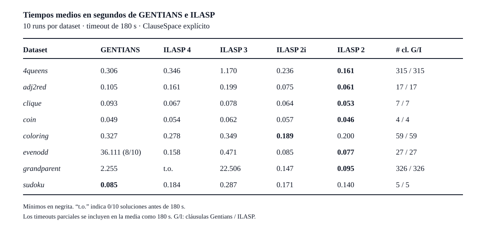

# Gentians frente a ILASP con espacios explícitos

## Protocolo

El experimento usa `4queens`, `adj2red`, `clique`, `coin`, `coloring`,
`evenodd`, `grandparent` y `sudoku`. Para cada dataset, Gentians genera su
`ClauseSpace` canónico. Ese conjunto se entrega a ILASP mediante definiciones
explícitas `length ~ clause`, sin mode declarations. El coste de una cláusula
es su número de literales de cuerpo más sus literales de cabeza.

Se ejecutaron 10 runs de Gentians `steady_state` y 10 de cada versión ILASP 2,
2i, 3 y 4. Las ejecuciones fueron secuenciales y tuvieron un timeout de 180 s.
Gentians usó seeds consecutivas; ILASP no expone aleatoriedad en este protocolo.

La métrica es `total_execution` para Gentians y `%% Total` para ILASP. Un
timeout cuenta como 180 s, es decir, PAR1. De este modo se usan los tiempos
internos canónicos y el arranque de WSL no contamina las cifras de ILASP.

La generación del archivo explícito ocurre una sola vez y queda fuera del
tiempo ILASP. El tiempo Gentians sí incluye su generación de cláusulas. Por
tanto, esta comparación favorece a ILASP frente a una comparación de pipelines
completos; mide principalmente la búsqueda sobre el mismo conjunto de reglas.

## Resultados

Las celdas muestran la media PAR1 en segundos. Entre paréntesis aparece la tasa
de solución cuando no fue 10/10.

| Dataset | GENTIANS | ILASP 4 | ILASP 3 | ILASP 2i | ILASP 2 | # cl. G/I |
|---|---:|---:|---:|---:|---:|---:|
| 4queens | 0.306 | 0.346 | 1.170 | 0.236 | **0.161** | 313 / 313 |
| adj2red | 0.105 | 0.161 | 0.199 | 0.075 | **0.061** | 17 / 17 |
| clique | 0.093 | 0.067 | 0.078 | 0.064 | **0.053** | 6 / 6 |
| coin | 0.049 | 0.054 | 0.062 | 0.057 | **0.046** | 4 / 4 |
| coloring | 0.327 | 0.278 | 0.349 | **0.189** | 0.200 | 59 / 59 |
| evenodd | 36.111 (8/10) | 0.158 | 0.471 | 0.085 | **0.077** | 27 / 27 |
| grandparent | 2.255 | t.o. | 22.506 | 0.147 | **0.095** | 326 / 326 |
| sudoku | **0.085** | 0.184 | 0.287 | 0.171 | 0.140 | 4 / 4 |

`# cl. G/I` muestra las cláusulas disponibles para Gentians e ILASP. Los
valores coinciden porque el experimento entrega explícitamente a ILASP el mismo
`ClauseSpace` generado por Gentians.

ILASP 2 obtiene el menor tiempo en seis de ocho datasets. ILASP 2i gana en
`coloring` y Gentians en `sudoku`. Gentians presenta dos colas de 180 s en
`evenodd`, aunque la mediana es 0.127 s. ILASP 4 no resuelve ninguno de los diez
runs de `grandparent`; ILASP 3 resuelve los diez con una media de 22.506 s,
mientras ILASP 2 tarda 0.095 s.

Los resultados crudos y el resumen agregado viven bajo
`.benchmarks/experiments/ilasp-all-explicit/`. El gráfico usa escala logarítmica
para conservar visibles los tiempos entre centésimas de segundo y 180 s.
